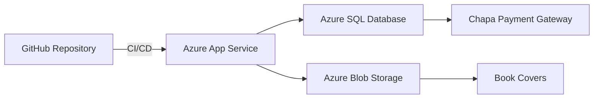

# BulkyBooks Web App 📚

[](https://dotnet.microsoft.com/)
[](https://docs.microsoft.com/aspnet/core)
[](https://opensource.org/licenses/MIT)

> A full-stack book management platform with integrated e-commerce capabilities

**Live Demo**: [https://bulkybooks-webapp-bsd0h3gfdad2bvag.eastus-01.azurewebsites.net/](https://bulkybooks-webapp-bsd0h3gfdad2bvag.eastus-01.azurewebsites.net/)  
*Note: Repository is currently private - [DM me](https://github.com/Betsegaw-hp) with your GitHub username for access*


---

## 🖼️ Infrastructure Dashboards

### Azure Monitoring
| Dashboard                 | Screenshot                                                                 | Description                                                                 |
|---------------------------|----------------------------------------------------------------------------|-----------------------------------------------------------------------------|
| **Web App Service**       |          | CPU/Memory metrics, deployment logs, and scaling status                    |
| **SQL Server**            |           | Query performance insights, index optimization, and connection statistics  |

### Application Analytics
| Dashboard                     | Screenshot                                                                 | Description                                                                 |
|-------------------------------|----------------------------------------------------------------------------|-----------------------------------------------------------------------------|
| **Order Management**          |       | Bulk actions, advanced filtering, and order lifecycle tracking             |
| **Payment Analytics**         |  | Payment success/failure logs with webhook response monitoring               |

---

## 🌟 Key Features

- **Role-Based Access Control** (Reader, Author, Admin)
- **E-commerce Workflow** with Chapa payment integration
- **Order Management Dashboard** with bulk actions
- **Automated CI/CD Pipeline** via GitHub Actions
- **Azure Cloud Infrastructure** (App Service + SQL Server)
- **Responsive UI** built with Bootstrap 5

---

## 🛠️ Tech Stack

| Component           | Technology                          |
|---------------------|-------------------------------------|
| **Frontend**        | Bootstrap 5 + Razor Pages          |
| **Backend**         | ASP.NET Core MVC (.NET 8)          |
| **Database**        | Azure SQL Server                   |
| **Payment Gateway** | Chapa                              |
| **CI/CD**           | GitHub Actions → Azure Deployment  |
| **Monitoring**      | Azure Application Insights         |

---

## 🔐 Authentication Matrix

| Role    | Permissions                                  |
|---------|---------------------------------------------|
| Reader  | Browse books, manage cart, view orders     |
| Author  | + Create books/categories                  |
| Admin   | + User management, order analytics         |

---

## 📦 Deployment Architecture



---

## 🧪 Testing Credentials

```ini
# Admin Account
Username: admin
Password: 123456

# Test Payment Card
Number: 4200 0000 0000 0000
CVV: 123
Expiry: 12/34
```

---

## 📈 Roadmap

- [x] Core E-commerce Features
- [x] Azure Deployment Pipeline
- [ ] S3 Image Storage Integration
- [ ] Social Auth (Google/Apple)
- [ ] Book Rental System
- [ ] Community Review System

---

## 🤝 Contributing

1. Fork the project (access required)
2. Create your feature branch
```bash
git checkout -b feature/amazing-feature
```
3. Commit your changes
```bash
git commit -m 'Add some amazing feature'
```
4. Push to the branch
```bash
git push origin feature/amazing-feature
```
5. Open a Pull Request

---

## 📄 License

Distributed under the MIT License. See `LICENSE` for more information.

---

📬 **Contact**: Betsegaw Tesfaye - [@betsegaw_hp](https://twitter.com/betsegaw_hp)  
🌐 **Portfolio**: [betsegaw.engineer](https://betsegaw.engineer)
